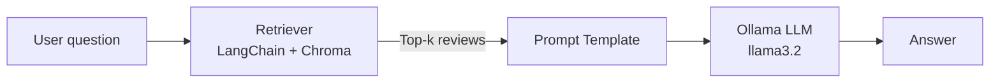
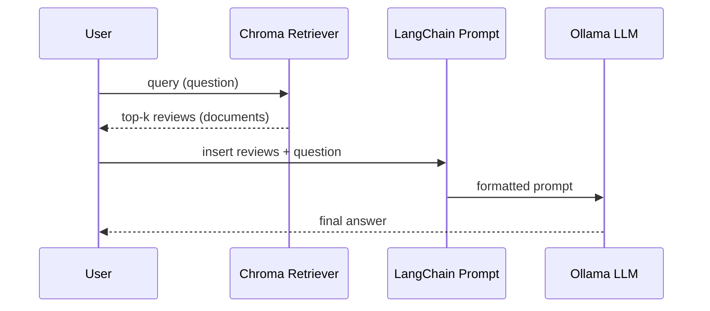

# Reviews RAG (Ollama + LangChain + Chroma)


A tiny Retrieval-Augmented Generation (RAG) app that answers questions about a pizza restaurant by retrieving the most relevant customer reviews and feeding them to a local LLM via Ollama.

- **LLM**: `llama3.2` (local via Ollama)
- **Embeddings**: `mxbai-embed-large` (local via Ollama)
- **Vector store**: Chroma (via `langchain-chroma`, persisted locally)
- **Interface**: simple CLI loop (`q` to quit)

---

## Contents

- [Quickstart](#quickstart)
- [How it works](#how-it-works)
- [Project layout](#project-layout)
- [Data requirements](#data-requirements)
- [Configuration & tuning](#configuration--tuning)
- [Troubleshooting](#troubleshooting)
- [Roadmap / ideas](#roadmap--ideas)
- [License](#license)

---

## Quickstart

> Requires **Python 3.10+** and **Ollama** installed locally.

1) **Install Python deps**
```bash
pip install langchain-ollama langchain-core langchain-chroma chromadb pandas
```

2) **Pull the models**
```bash
ollama pull llama3.2
ollama pull mxbai-embed-large
```

3) **Place your dataset**
- Put a CSV named `restaurant_reviews.csv` in the repo root.
- Minimum columns: `Title, Review, Rating, Date` (see [Data requirements](#data-requirements)).

4) **Run the app**
```bash
python main.py
```
Type a question (e.g. *“What do customers say about the crust?”*) and press **Enter**. Type `q` to quit.

---

## How it works

### Architecture (flow)


### Sequence (end-to-end)


**Key pieces:**
- **`vector.py`** builds/opens a persistent **Chroma** store (`./chrome_langchain_db`) using **OllamaEmbeddings** (`mxbai-embed-large`). On first run it ingests the CSV into the vector DB, then exposes a `retriever` (`k=5`).  
- **`main.py`** wires a **ChatPromptTemplate** to **OllamaLLM** (`llama3.2`). For each question, it calls `retriever.invoke()` to get relevant reviews, then sends them (plus the question) through the prompt to the model.  

---

## Project layout

```
.
├── main.py                      # CLI app: prompt + LLM + retriever
├── vector.py                    # Chroma vector DB + embeddings + retriever
├── restaurant_reviews.csv  # Your dataset (add this)
└── README.md                    # This file
```

---

## Data requirements

Place `restaurant_reviews.csv` at the repo root with the following columns:

- **Title** (short headline for the review)
- **Review** (full text)
- **Rating** (numeric or categorical; stored as metadata)
- **Date** (ISO-like or readable string; stored as metadata)

**Example (header + one row):**
```csv
Title,Review,Rating,Date
"Best Margherita","The crust is airy and the basil is super fresh!",5,"2024-05-17"
```

> On first run, vectors are created and persisted under `./chrome_langchain_db`. Subsequent runs reuse this index.

---

## Configuration & tuning

- **Models**
  - LLM: change in `main.py`: `OllamaLLM(model="llama3.2")`
  - Embeddings: change in `vector.py`: `OllamaEmbeddings(model="mxbai-embed-large")`
- **Top‑K retrieval**
  - In `vector.py`: `as_retriever(search_kwargs={"k": 5})`
- **Persistence path**
  - In `vector.py`: `db_location = "./chrome_langchain_db"`
- **Prompt**
  - In `main.py`: edit the `template` string to adjust system behavior and formatting.

**Tips**
- Use concise, task-focused prompts; keep retrieved context within your local LLM’s context window.
- Consider light chunking if your reviews are long (split by sentences/paragraphs before embedding).

---

## Troubleshooting

- **Models not found**: Ensure you ran `ollama pull llama3.2` and `ollama pull mxbai-embed-large`.
- **Ollama not running**: Start the Ollama service/daemon before running `python main.py`.
- **Missing CSV**: Ensure `restaurant_reviews.csv` exists and has the required columns.
- **Typos to consider fixing** (optional):
  - In `main.py`, `exeprt` → `expert` (prompt string).
  - In `vector.py`, `chrome_langchain_db` → `chroma_langchain_db` (purely cosmetic, current path works).

---

## Roadmap / ideas

- Web UI (FastAPI/Flask + HTMX/React) for questions and answers
- Add simple **feedback signals** to re-rank or filter reviews
- Support multiple datasets (pizzas, burgers, pastas) via **collections**
- Add **evaluation harness** (e.g., question/answer pairs and retrieval metrics)
- Optional **document chunking** and metadata filters (date, rating thresholds)

---

## License

MIT
